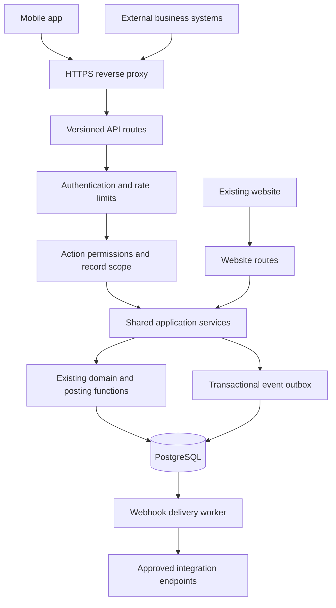
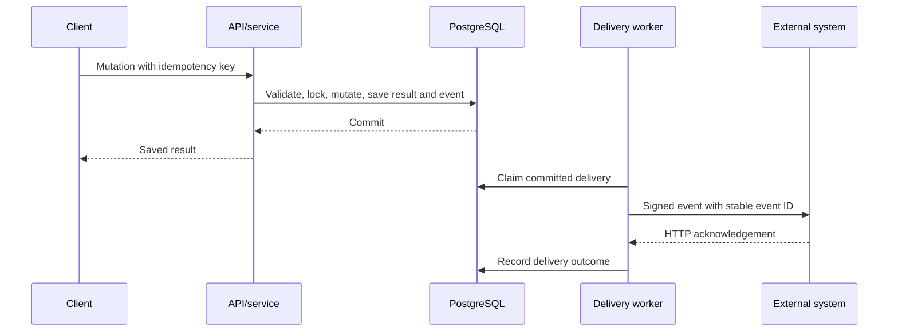

# Work Master API implementation plan and report

Prepared: 10 October 2026. Status: proposed implementation; this document does not mean these features are available. Scope: one versioned API serving a mobile app and external business integrations. The existing website continues to use the same application data and business rules.

## 1. Executive recommendation

Extend the existing Node/Express application with `/api/v1`. Keep PostgreSQL as the application system of record and reuse existing domain functions. Introduce shared application services for authorization, validation, and workflow orchestration so website and API requests produce equivalent results.

Begin with authentication, master-data reads, stock balances, and invoice reads. Add draft invoice creation, submission, and payments after transaction and concurrency checks pass. Add purchasing, inventory mutations, reports, and webhooks in later phases. HR requires a separate permission and privacy review before exposure.

The deliverable is a supported API contract, not merely a set of routes. It includes credentials, permission enforcement, reliable retries, audit attribution, automated integration tests, client documentation, deployment procedures, and operational monitoring.

## 2. Current implementation and gaps

The following findings are based on repository inspection, rather than assumptions about a deployed installation.

| Area | Current evidence | Implementation implication |
| --- | --- | --- |
| Server | `server.js` runs Express, parses JSON with a 1 MB limit, and mounts `/api` | Add a versioned router and explicit request limits |
| Existing JSON routes | `src/web/routes/api.js` provides customer, supplier, item, warehouse, pricing, stock, and reference lookups | Preserve these contracts for current browser scripts |
| Authentication | `src/auth-http.js` authenticates `wm_session` cookies and supplies `req.currentUser` | Introduce API credentials without bypassing user policy |
| Session policy | `src/auth.js` defines seven-day maximum lifetime and five-minute inactivity expiration | Design mobile sessions explicitly; do not silently extend browser sessions |
| Route permissions | `src/authorize.js` classifies known paths and denies unknown paths | `/api/v1` requires explicit method/path classification |
| Record access | `src/access.js`, `src/user-record-access.js`, and `src/voucher-ownership.js` enforce named scopes and ownership | Apply restrictions to lists, details, mutations, exports, and linked records |
| Invoice workflow | `src/web/routes/sales.js` contains payload building, item validation, and receipt-account checks | Extract reusable workflow services before exposing writes |
| Domain/storage | `src/domain/sales.js`, other domain modules, `src/store.js`, and `src/core.js` expose persistence and transaction facilities | Reuse and audit these facilities instead of copying posting logic |
| Audit | `src/audit.js` supplies request actor context and database audit stamping | Authenticate API actors before checking out database connections |
| Deployment | `docker-compose.yml` runs the app and PostgreSQL; README documents TLS and proxy requirements | Extend the existing deployment with worker operations and API configuration |
| Tests | `package.json` includes permission, accounting, security, and PostgreSQL checks | Add API contract, credential, concurrency, and webhook tests |

The existing API is principally a website lookup interface. Inspection does not establish a complete public invoice API, mobile bearer authentication, integration credential lifecycle, API idempotency storage, or webhook delivery system.

An important existing behavior: the website's create-and-submit invoice path creates the draft and then submits it in separate calls. If submission fails, it retains the draft and tells the user. Version 1 should expose draft creation and submission as separate operations. A future combined operation must define its atomicity explicitly.

## 3. Proposed architecture



Routes handle HTTP input and output. Application services implement business actions with an authenticated actor. Domain functions retain financial and stock invariants. PostgreSQL owns durable credentials, retry records, events, and business records. A worker handles outbound delivery outside the user's request.

Suggested new modules, subject to implementation review:

```text
src/api/v1/                 versioned resource routers
src/api/auth.js            mobile and integration authentication
src/api/errors.js          stable JSON error translation
src/api/serializers.js     explicit public response fields
src/api/idempotency.js     duplicate-request coordination
src/services/sales.js      shared sales workflow orchestration
src/services/purchasing.js shared purchasing workflows
src/services/inventory.js  shared inventory workflows
src/integrations/          webhook policy, signing, delivery
scripts/webhook-worker.js  supervised delivery worker
docs/api/                  contract and client examples
```

Avoid a large rewrite. Extract one workflow at a time, demonstrate website/API parity, and retain existing route behavior unless an intentional behavior change is documented.

## 4. Authentication and permission model

### Mobile users

Use existing usernames and password verification with a dedicated mobile session lifecycle. Proposed defaults are short-lived opaque access tokens, approximately 15 minutes, and rotating refresh tokens with a maximum lifetime of 30 days. These durations are design proposals requiring a product decision before implementation.

Store token hashes, expiration, device/session identifiers, and revocation state. Never store plaintext tokens. Native clients keep refresh credentials in operating-system secure storage. Rotation must be transactional; replay of an already used refresh token revokes its token family. Clients must coordinate refresh requests to avoid accidental concurrent reuse.

Password change/reset revokes mobile sessions as well as existing browser sessions. Every request resolves current role, denials, and record scope. Handle temporary-password accounts with a JSON `password_change_required` response and an authenticated password-change operation rather than an HTML redirect. Login and refresh endpoints must be registered before the normal authenticated-route gate, while preserving rate limiting and transport security.

### External integrations

Create a dedicated non-admin service account for each integration. Issue a high-entropy bearer token with a credential ID, hashed secret, owner account, granted scopes, expiry, creation metadata, last-used timestamp, and revocation state. Display its secret once. Support overlapping credentials during rotation, then revoke the old credential.

Service accounts should not permit interactive login. Do not represent integrations as unrestricted Admin users. Version 1 can support administrator-issued tokens; delegated third-party authorization can be assessed later if customers need to grant access themselves.

### Effective access

Access requires all of: active credential, credential scope, current user action permission, record scope, voucher visibility, and allowed workflow state. A token scope narrows access; it never grants a permission the account lacks. Preserve HR separation, account restrictions, warehouse restrictions, price-list restrictions, and Standard-role ownership rules.

Use existing real permission keys in endpoint policy mappings. Proposed API scopes such as `invoices:read` and `invoices:write` are an additional credential restriction, not replacements for `vouchers.sales.view`, create, edit, submit, or cancel checks. Payment scopes and action permissions remain distinct.

Requests using cookie authentication retain existing origin protections. Bearer authentication must be deliberately distinguished from cookie authentication; do not globally disable origin checks. Native apps do not need browser CORS. If a separate browser frontend is added, configure an explicit origin allowlist. Reject ambiguous mixed credentials.

## 5. Proposed API contract

All paths below are proposed under `/api/v1`; they are not currently documented as implemented.

| Resource | Endpoints | Delivery phase |
| --- | --- | --- |
| Authentication | `POST /auth/login`, `/auth/refresh`, `/auth/logout`, `/auth/password`; `GET /me` | 1 |
| Master data | `GET /customers`, `/suppliers`, `/items`, `/warehouses`, `/price-lists`, `/cost-centers` | 1 |
| Stock | `GET /stock-balances` with permitted warehouse/item filters | 1 |
| Sales reads | `GET /invoices`, `/invoices/:id`, `/invoices/:id/payments` | 1 |
| Sales actions | `POST /invoices`; `PATCH /invoices/:id`; `POST /invoices/:id/submit`, `/cancel` | 2 |
| Receipts | `POST /invoices/:id/payments`; `POST /invoices/:id/payments/:paymentId/cancel` | 2 |
| Purchasing | List/detail/create/edit/submit/cancel purchase orders and purchases; supplier payment actions | 3 |
| Inventory writes | Stock entry and reconciliation draft, submit, and cancel workflows | 3 |
| Reports | Authorized stock, customer statement, and accounting report endpoints | 3 |
| Integration administration | Credential and webhook subscription management, delivery status and redelivery | 4 |
| HR | Separately approved employee/payroll resources | Later |

Master-data creation is a later extension. Preserve inactive-by-default creation and existing reference/deletion restrictions when it is added. Do not expose roles, password hashes, session hashes, raw audit internals, or whole database rows through resource serializers.

### Request and response conventions

- JSON request bodies, explicit schemas, bounded arrays/strings, and rejection of unknown writable fields.
- Stable resource IDs represented as strings, with voucher numbers as separate business identifiers.
- Dates use `YYYY-MM-DD`; timestamps include UTC offsets. Posting dates/times follow existing business configuration and are distinct from creation timestamps.
- Money and quantity use decimal strings in the public contract. Adapt to existing rounding helpers without floating-point client assumptions; server-calculated totals are authoritative.
- Lists accept allowlisted filters and sort keys. Start with paged results, default 50 and maximum 200, using stable ID tie-breaking. Scope filters run before counts and pagination.
- Success responses use `data`; list metadata includes page, page size, and permitted-record count. Secret-bearing responses use `Cache-Control: no-store`.
- Define currency explicitly; initial sales pricing must preserve current UGX and price-list constraints.
- Maintain an OpenAPI contract with examples. Additive compatible fields stay in v1; breaking behavior requires a new major version and a communicated migration period.

Illustrative draft request; exact fields must be verified during contract implementation:

```http
POST /api/v1/invoices
Authorization: Bearer <credential>
Idempotency-Key: <unique-client-operation-id>
Content-Type: application/json
```

```json
{
  "customer_id": "CUSTOMER-001",
  "warehouse": "Main Store",
  "price_list": "Retail",
  "posting_date": "2026-10-10",
  "items": [{ "item_code": "ITEM-001", "quantity": "2", "rate": "15000" }]
}
```

Client rates are subject to existing policy and validation. The server supplies computed totals and the saved draft state. Creating a draft does not submit it or record a payment.

### Errors

Use an envelope such as:

```json
{
  "error": {
    "code": "validation_failed",
    "message": "One or more invoice fields are invalid.",
    "fields": { "warehouse": "Select an active permitted warehouse." },
    "request_id": "<request-id>"
  }
}
```

Define 400 for malformed input, 401 for missing/expired credentials, 403 for forbidden actions, 404 for missing or deliberately concealed resources, 409 for state/idempotency conflicts, 412 for stale version preconditions, 422 for business validation, 429 for throttling, and 503 for temporary unavailability. Never return SQL errors, stack traces, or HTML login pages through the versioned API. Document password-change requirements and retry guidance as stable codes.

## 6. Financial correctness, concurrency, and retries

Submission, cancellation, stock changes, and payment posting must retain the existing database accounting rules. Audit transaction boundaries and row locking before adding each write endpoint. Perform final stock/account/state checks inside the transaction; an earlier HTTP validation cannot protect against a concurrent request.

Require an idempotency key for creation, submit/cancel, and payment requests. Persist the principal, method, normalized route, key, canonical request hash, resulting status, resource reference, and sanitized response. Enforce a database unique constraint on the principal/operation/key combination.

For the same key and payload, return the committed result. For a different payload, return 409. Concurrent duplicate requests must result in one mutation. Commit the business mutation, retry record, and any outbox event atomically. Existing domain functions that open their own transactions may need transaction-aware service variants; an outer transaction does not automatically encompass a function using another pooled connection.

Recheck current authorization before replaying a stored response. Never replay data to a credential whose access was revoked. Define retention before launch: proposal, at least seven days for ordinary mutations, with durable external references and unique constraints for imported payments. Once a key expires, clients must not assume it still prevents duplicates.

Add an integer resource version and `ETag`/`If-Match` preconditions for draft edits. Increment the version for website and API changes. Reject stale edits without overwriting another user's work. Idempotency does not replace row locks, state-machine checks, version control, or payment-reference uniqueness.

Clear existing invoice and report caches after API mutations using the same invalidation paths as website changes. Cache keys must incorporate effective access; avoid shared caches of user-scoped responses unless isolation is demonstrated.

## 7. Mobile workflow and synchronization

Support online use first: sign in, load permitted reference data, check current stock/pricing, save a draft, submit it, record an authorized receipt, and retrieve the updated state. The client displays validation and permission failures directly.

Offline draft editing can follow later. Keep a device-generated operation ID for queued requests. On reconnect, reload permissions and validate current item, warehouse, price-list, stock, and invoice state. Stock shown offline is informational; submission occurs online and can fail if availability changed.

Do not promise incremental synchronization using only `updated_at` filters: records may disappear through deletion or permission changes. A later durable change feed requires ordered cursors, deletion tombstones, retention rules, and a full-resync path when scope changes or cursors expire. Begin with bounded pagination and explicit refresh.

## 8. Webhooks and integration reliability

Proposed events include `invoice.submitted`, `invoice.cancelled`, `payment.recorded`, `payment.cancelled`, and later purchasing/stock equivalents. Write an event into an outbox in the same transaction as the business action. A separately supervised worker claims committed events and delivers them asynchronously.



Delivery is at least once. Consumers deduplicate by event ID; ordering is not guaranteed across deliveries. Include event version, resource ID/version, event time, and minimal metadata. Consumers fetch current permitted data through the API rather than receiving complete financial documents in every webhook.

Use HTTPS endpoints, per-subscription signing secrets, timestamped signatures over exact payload bytes, timeouts, bounded response bodies, exponential retry with jitter, attempt limits, and a failed-delivery queue with explicit redelivery controls. Never retry a mutation to generate an event again.

Prevent server-side request forgery: restrict destinations, validate resolved addresses, block private/loopback/link-local and metadata destinations, and do not follow redirects to unchecked hosts. Recheck account permissions when delivering; disable revoked subscriptions and avoid sending data after scope removal. Log delivery metadata without secrets or sensitive payloads.

## 9. Proposed database changes

| Table/change | Purpose | Essential controls |
| --- | --- | --- |
| Mobile sessions/token families | Device sessions, access/refresh hashes, rotation and expiry | Unique hashes, user indexes, transactional reuse detection |
| Integration credentials | Account, scope set, secret hash, expiry, revocation | No plaintext secret; least-privilege administration |
| Idempotency records | Request hash and committed mutation response | Unique operation key, expiry index, access-aware replay |
| Voucher resource versions | Concurrent draft edit protection | Version increment from every mutation channel |
| Event outbox | Durable post-commit event delivery | Stable event ID, bounded claim batches, recovery leases |
| Webhook subscriptions/deliveries | Approved endpoints, encrypted signing material, attempt history | Restricted management, retention, credential rotation |
| Optional external-reference mapping | Import reconciliation and duplicate prevention | Uniqueness within integration/resource namespace |

Use the existing migration framework. Decide audit treatment table by table: generic audit triggers must not accidentally expose sensitive credential fields or turn cleanup into permanent secret retention. Test upgrades from the supported current schema and fresh installation. Keep migrations compatible with staged deployment where practical.

## 10. Testing and acceptance criteria

Use a dedicated test PostgreSQL database, never the application database. Add contract tests for schema validation, serialization, status codes, pagination, and unknown routes/methods. Integration tests must exercise real HTTP authentication and database transactions.

| Scenario | Required outcome |
| --- | --- |
| Existing browser lookup routes | Existing contracts and website workflows remain functional |
| Standard-role user reads another user's voucher | Existing ownership/employee exceptions are preserved |
| Guessed IDs, linked payments, exports | No cross-scope data exposure |
| Restricted integration token | Scope cannot broaden its account permissions |
| Permission change or token revocation | Next request is denied; retry replay cannot bypass checks |
| Temporary-password login | JSON-required password change; no protected business access |
| Concurrent refresh token reuse | Defined token-family policy enforced |
| Repeated/concurrent payment with the same key | Exactly one payment and one set of ledger effects |
| Same key, changed payload | Conflict without additional writes |
| Two submissions consume scarce stock | Database-enforced availability; no duplicate posting |
| Stale draft update | Precondition failure; newer edits retained |
| Posting or event insert fails | Entire intended transaction rolls back |
| API-created invoice | Correct creator audit identity and website visibility |
| API mutation after cached website read | Website refresh reflects the committed change |
| Worker fails after sending before acknowledgement storage | Safe duplicate delivery with the same event ID |
| Worker restart and revoked subscription | Pending work recovers; revoked delivery is suppressed |
| Malicious webhook destination | Blocked before outbound request |

Compare equivalent website/API scenarios for prices, totals, stock ledger, general ledger, cancellation, and payment allocation. Run existing release checks and accounting/HR suites where affected. Conduct staging load tests with realistic volumes, scoped users, and write concurrency before setting production rate limits or latency commitments.

## 11. Operations and deployment

Enforce HTTPS and the existing supported reverse-proxy configuration. Apply body/time limits and distributed or database-backed throttling where multiple app instances operate; the existing in-memory login failure map does not coordinate across replicas. Separate login limits from per-user/integration request quotas and costly report/export limits. Return `Retry-After` on throttling.

Record request IDs, route templates, actor/credential IDs, result codes, duration, and idempotency outcome. Redact authorization headers, cookies, passwords, refresh tokens, secrets, and sensitive request bodies. Sanitize query logging: current slow-request logging includes `originalUrl`, so secrets must never be put in query strings and sensitive filters need review.

Track authentication failures, error rates, p95 latency by endpoint, database pool utilization, lock waits, duplicate-request conflicts, outbox backlog age, delivery failures, and worker liveness. Avoid resource-ID labels in metrics. Define alerts and targets from measured staging results.

Deploy behind a feature flag to internal testers, then one mobile pilot and one integration account. Release database changes, compatible application code, and worker configuration with a tested rollback procedure. If the API is disabled, preserve committed vouchers and pending events; rollback must not restore credentials or reverse financial postings. Back up new tables and signing-secret encryption configuration, and test restoration and queued-delivery recovery.

## 12. Implementation phases and indicative effort

Estimates are planning ranges for one experienced backend developer with frontend/client and reviewer availability. They exclude building the mobile UI, external-system adapters, procurement, and unknown data cleanup. Re-estimate after Phase 0; they are not delivery commitments.

| Phase | Work | Exit criteria | Estimate |
| --- | --- | --- | --- |
| 0: Contract and workflow audit | Finalize resources, auth policy, permission mappings, transaction boundaries, OpenAPI skeleton | Reviewed contract and scoped backlog; documented unknowns | 3–5 working days |
| 1: Foundation and reads | Auth lifecycle, explicit versioned policy, serializers/errors, master and invoice reads, administration minimum | Mobile and integration account can access only permitted data; credential lifecycle tested | 8–12 days |
| 2: Sales writes | Shared sales services, idempotency, version checks, invoice submission/cancellation, payments, cache/audit parity | Concurrent/retry/accounting tests pass; sales pilot ready | 10–15 days |
| 3: Purchasing/inventory/reports | Shared additional workflows, write endpoints, scoped reports | Module-specific permission and posting suites pass | 10–18 days |
| 4: Webhooks and launch hardening | Outbox worker, signing, retries, SSRF controls, monitoring, production pilot | Recovery drills and client acceptance pass | 7–12 days |

Total indicative backend effort: 38–62 working days, approximately 8–13 full-time working weeks. A useful read API arrives after Phases 0–1; a sales MVP after Phase 2, approximately 21–32 working days. Delivery can change materially if transaction refactoring or service-account management is larger than expected.

Each phase includes tests and documentation. Parallel client development can begin after the contract is stable, using fixtures while endpoints are implemented.

## 13. Risks and decisions

| Risk | Consequence | Planned response |
| --- | --- | --- |
| Calling persistence directly skips web validation | Invalid or unauthorized vouchers | Shared services and website/API parity tests |
| Nested independent transactions | Duplicate or partially committed operations | Audit and refactor transaction ownership before writes |
| Service-account role choice changes ownership visibility | Integration cannot reconcile records, or sees too much | Define dedicated roles/scopes and test Standard-role behavior |
| Retry and offline assumptions are unclear | Duplicate invoices/payments | Idempotency retention and external-reference contract |
| Raw data serialization | Financial/HR or credential disclosure | Explicit field serializers and scoped queries |
| API writes bypass cache invalidation | Stale website totals | Reuse invalidation hooks and verify refresh behavior |
| Webhook outages or revoked access | Delivery gaps or disclosure | Durable outbox, retries, access checks, redelivery |
| Expanding into full HR too soon | Sensitive-data and approval-rule errors | Separate HR scope and acceptance review |

Before coding, settle: native app versus browser/mobile hybrid; mobile session durations; exact external systems and reference IDs; invoice/payment MVP scope; rate-override policy; integration ownership role; idempotency retention; required offline behavior; webhook destinations and event subscriptions; expected volume and deployment topology. These refine implementation, but do not prevent contract drafting and transaction review.

## 14. Documentation and handover

As implementation lands, update `docs/app-guide.md` for API-visible workflow and validation changes, `docs/permissions.md` for service accounts/scopes and access rules, and `README.md` for configuration, migrations, workers, and operations. Keep proposed endpoints in this plan until they exist; publish implemented endpoints in `docs/api/` with the OpenAPI contract, authentication examples, error/retry guidance, and webhook verification examples.

Handover includes contract/version policy, staging credentials issued through the supported administration flow, client examples without real secrets, test evidence, measured capacity, backup/restore steps, credential rotation, worker recovery, and incident procedures. The launch gate is successful use by both a mobile user and an integration account with verified permission isolation and financial correctness.
